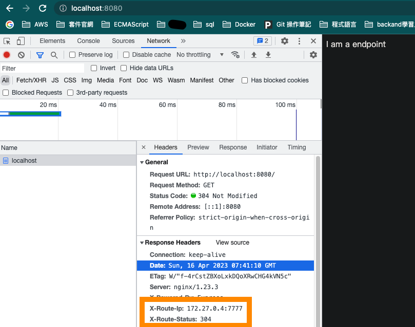

## Copy the file into the container
```bash
docker cp ~/pro/nginx/load_balancer/nginx.conf nginx:/etc/nginx/nginx.conf
```

## reload the new configuration
```bash
nginx -s reload
```

## build the app
```bash
docker build . -t myserver
```

## start or stop all app
```bash
# start
docker-compose up -d

# stop
docker network disconnect server_default nginx
docker-compose down
```

## because nginx server is also container too, so we need to add nginx to the same docker network as the app
```bash
docker network connect server_default nginx
```
## modify the upstream block, change the ip address to the app container name（docker will help us resolve DNS in the docker network）
```
upstream backendserver {
  server app:7777;
  server app2:7777;
  server app3:7777;
}
```

## check which machine is routed to
```t
# add this two line to location block
add_header X-Route-Ip $upstream_addr;
add_header X-Route-Status $upstream_status;
```
## open devtool and go to http://localhost:8080

