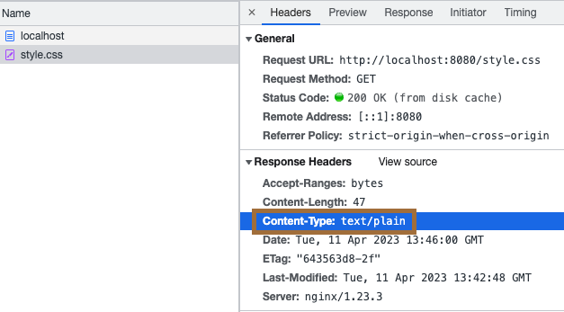

## Copy the file into the container
```bash
docker cp ~/pro/nginx/mime_type/nginx.conf nginx:/etc/nginx/nginx.conf
docker cp ~/pro/nginx/mime_type/site/ nginx:/etc/nginx/
```

## reload the new configuration
```bash
nginx -s reload
```
## hard reload (for sometime the browser cache the file)
```
cmd + shift + R
```


## Css file don't work because content-type is wrong. it should be text/css.

## to solve that you need to add types or include mime.types.